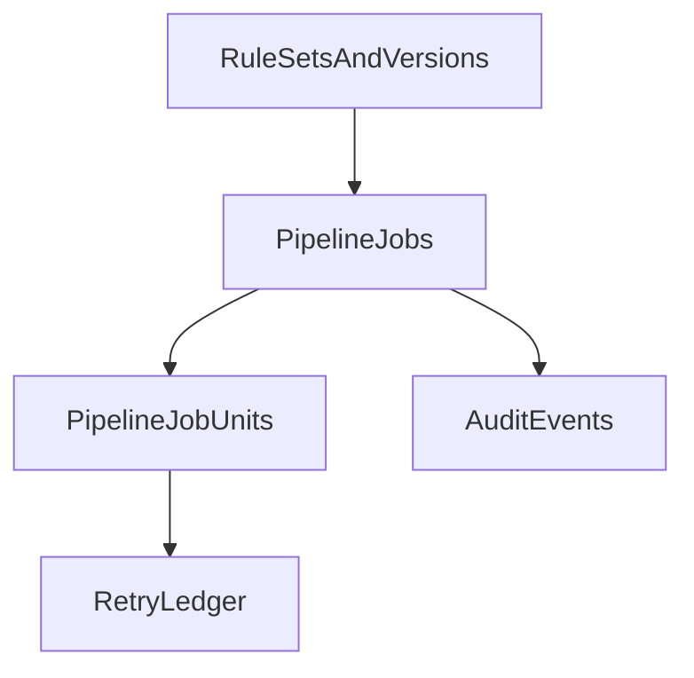

# Modelo de datos y auditoria

## Principios

- Separar estado operativo del workflow de evidencia auditiva.
- Versionar reglas y configuraciones ejecutadas.
- Registrar granularidad por corrida, paso y unidad.

## Entidades principales

## 1) WorkflowDefinitions

Define plantillas de workflow reutilizable.

Campos sugeridos:

- `workflowKey`
- `name`
- `description`
- `activeVersion`
- `status`

## 2) WorkflowVersions

Version inmutable de reglas y pasos.

Campos sugeridos:

- `workflowKey`
- `version`
- `configSchemaVersion`
- `stepsConfig`
- `qualityPlanId`
- `createdAt`
- `createdBy`

## 3) WorkflowRuns

Corrida concreta de una version.

Campos sugeridos:

- `runId`
- `workflowKey`
- `workflowVersion`
- `scope`
- `status` (`pending`, `running`, `completed`, `completed_with_warnings`, `failed`, `cancelled`)
- `startedAt`
- `completedAt`
- `correlationId`
- `initiatedBy`
- `summary`

## 4) WorkflowRunSteps

Estado por etapa de corrida.

Campos sugeridos:

- `runId`
- `stepKey`
- `status`
- `attempt`
- `startedAt`
- `completedAt`
- `inputSnapshotRef`
- `outputSnapshotRef`
- `errorRef`

## 5) WorkflowRunUnits

Unidad minima de procesamiento (ej. dia, mes, chunk).

Campos sugeridos:

- `runId`
- `stepKey`
- `unitKey`
- `payload`
- `status`
- `attempts`
- `checkpointRef`
- `metrics`

## 6) RuleSets y RuleSetVersions

Reglas de validacion, dedup, reconciliacion y enriquecimiento.

Campos sugeridos:

- `ruleSetKey`
- `domain`
- `version`
- `rules`
- `activationPolicy`
- `compatibility`

## 7) QualityChecks y QualityResults

Plan de calidad y resultados por corrida.

Campos sugeridos:

- `qualityPlanId`
- `checkKey`
- `checkType`
- `threshold`
- `severity`
- `resultStatus`
- `resultValue`

## 8) AuditEvents

Bitacora inmutable de eventos.

Campos sugeridos:

- `eventId`
- `runId`
- `stepKey`
- `unitKey` — identifica la unidad (p. ej. fecha `2024-01-15` en sync por rango); usado en la UI para mostrar qué día/unidad corresponde a cada `unit.completed`/`unit.failed`.
- `eventType`
- `timestamp`
- `actor`
- `payloadSummary`
- `resultSummary`
- `errorCategory`

Los conteos de registros por unidad (insertados, actualizados, eliminados) se almacenan en `pipelineJobUnits.result`; la UI de Run Detail los agrega para mostrar la tabla "Registros procesados" por día y el total, y los muestra también en cada línea de auditoría cuando el evento tiene `unitKey`.

## 9) RetryLedger

Historial de reintentos por unidad.

Campos sugeridos:

- `runId`
- `stepKey`
- `unitKey`
- `attempt`
- `delayMs`
- `reason`
- `decision`

## Relaciones logicas

(Nota: WorkflowDefinitions/WorkflowVersions se eliminaron del schema; el engine usa registro estático por jobType.)

## Retencion y gobernanza

- `AuditEvents`: retencion extendida para auditoria.
- `WorkflowRuns`: retencion media con resumen consolidado.
- `WorkflowRunUnits`: retencion operativa y archivado por ventana.
- Regla de inmutabilidad para `RuleSets` (versiones) y eventos auditivos.
