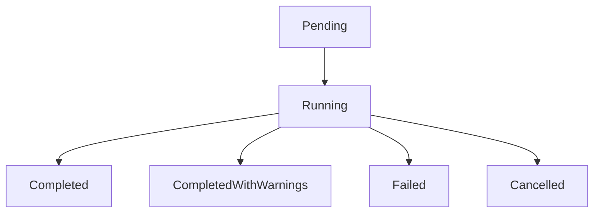
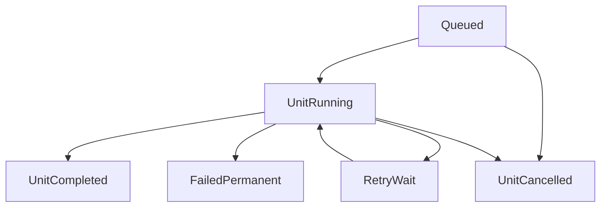

# Engine de workflows configurable

## Objetivo de arquitectura

Construir un runtime generico que ejecute workflows de datos definidos por configuracion versionada, con soporte nativo de reintentos, checkpoints y recuperacion.

## Componentes del engine

1. `Planner`
   - Interpreta `workflowVersion` + `scope`.
   - Genera plan ejecutable (steps y unidades).

2. `Scheduler`
   - Encola unidades segun dependencias y concurrencia.
   - Respeta restricciones de Convex y fuentes.

3. `Executor`
   - Ejecuta unidades por step.
   - Aplica timeout, retry policy y checkpoints.

4. `StateManager`
   - Persiste estado de run, step y unidad.
   - Garantiza idempotencia y transiciones validas.

5. `RuleEngine`
   - Evalua reglas declarativas para transformacion, dedup, reconciliacion y calidad.

6. `AuditEmitter`
   - Emite eventos estandarizados de ciclo de vida y evidencia.

## Modelo de estados

### Estado de corrida

- `pending`
- `running`
- `completed`
- `completed_with_warnings`
- `failed`
- `cancelled`

### Estado de unidad

- `queued`
- `running`
- `retry_wait`
- `completed`
- `failed_permanent`
- `cancelled`

## Transiciones principales





## Politica de reintentos

Cada step define politica propia:

- `maxRetries`
- `backoff` (`fixed`, `exponential`, `exponential_with_jitter`)
- `retryOn` (categorias de error)
- `timeoutMs`
- `circuitBreaker` opcional

## Recuperacion

### Recovery por unidad

- Reintento automatico para errores transitorios.
- Falla permanente para errores no retryables.

### Recovery por corrida

- Reanudacion desde checkpoints.
- Re-run parcial solo de unidades fallidas.
- Re-run completo idempotente bajo demanda.

## Restricciones y guardrails

- Lote por unidad configurable para no superar limites de tiempo.
- Control de concurrencia por fuente y por tipo de etapa.
- Backpressure para evitar throttling y OCC.
- Degradacion controlada: menor concurrencia ante aumento de error rate.

## Contrato de configuracion (ejemplo conceptual)

```json
{
  "workflowKey": "reconciliation_main",
  "version": "1.0.0",
  "steps": [
    {
      "stepKey": "extraction",
      "concurrency": 4,
      "retry": { "maxRetries": 5, "backoff": "exponential_with_jitter" },
      "timeoutMs": 120000
    }
  ]
}
```
