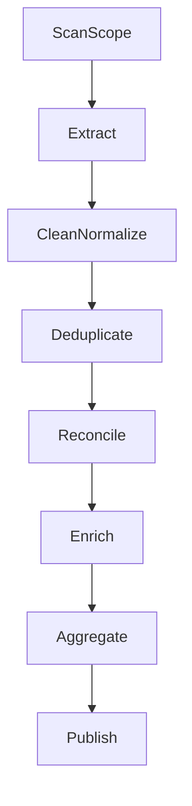

# Diseno ETL y reglas de calidad

## Flujo ETL objetivo (declarativo)

## 1) Scan previo obligatorio

Antes de extraer:

- Detectar ventanas pendientes por fuente.
- Estimar volumen esperado.
- Identificar gaps de watermark/checkpoint.
- Generar plan de unidades de trabajo.

Salida del scan:

- `scanSummary`
- `unitsToProcess`
- `riskFlags`
- `qualityPreconditions`

## 2) Extraccion configurable

Reglas por fuente:

- pagina/lote por llamada
- estrategia de reintento
- limite de concurrencia
- timeout por unidad

Debe soportar:

- CloudWatch throttling
- DynamoDB paginacion
- reanudacion con cursor/checkpoint

## 3) Limpieza y normalizacion

Reglas declarativas:

- normalizacion de estatus
- normalizacion de campos de fecha
- validacion de formatos
- saneamiento de nulos y campos vacios

## 4) Deduplicacion

Tipos de regla soportados:

- por llave natural (ej. referencia)
- por llave tecnica (ej. transactionId)
- por prioridad de fuente (ej. payment > v2 > v1)
- por version mas reciente (`updatedAt`)

Resultado:

- set de registros canonicales
- registro de colisiones y decision aplicada

## 5) Reconciliacion

Reglas versionadas por dominio:

- conjunto comparable por fuente
- criterios de igualdad/mismatch
- tolerancias por montos/fechas
- clasificacion de diferencias

Salidas:

- reconciled
- unmatched_source_a
- unmatched_source_b
- mismatched_fields

## 6) Enriquecimiento

Reglas de enrichment:

- extraccion de atributos de `raw`
- validacion de calidad del enrichment
- fallback por prioridad de atributo

Debe guardar:

- origen del dato enriquecido
- score de confianza (si aplica)
- motivo de enrichment omitido

## 7) Agregacion y publicacion

- Agregados por dia/mes/anio definidos por configuracion.
- Contratos de salida estables para dashboards.
- Version de agregacion incluida en metadata de salida.

## Controles de calidad por etapa

## Pre-ingest

- campos obligatorios presentes
- fecha parseable
- monto en rango valido

## Post-transform

- porcentaje de registros invalidos bajo umbral
- tasa de dedup esperada
- consistencia de llaves

## Pre-publish

- reconciliacion cerrada o con warnings justificados
- agregados cuadran contra base canonica
- evidencia auditiva completa

## Politica de severidad

- `pass`: continua sin bloqueo.
- `warn`: continua con marca de riesgo.
- `fail`: bloquea avance a la siguiente etapa.
