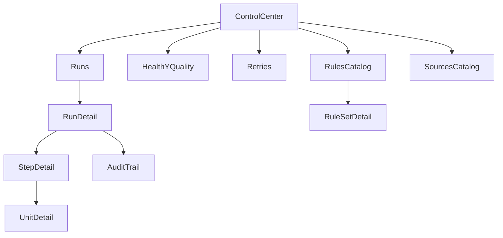

# UI/UX futura: plataforma operativa generica

## Objetivo

Definir pantallas reutilizables para operar workflows multi-fuente sin acoplar la UI a CloudWatch/DynamoDB ni a reglas hardcodeadas.

## Principios de diseno

- **Source-agnostic:** toda vista parte de `workflow`, `run`, `step`, `unit`, no de una fuente fija.
- **Config-driven:** formularios y tablas guiados por metadata de reglas/versiones.
- **Operable y auditable:** cada accion deja evidencia y contexto.
- **Progressive disclosure:** vista ejecutiva primero, detalle tecnico bajo demanda.

## Mapa de informacion (IA)

## Pantallas propuestas (MVP + escalables)

## 1) Control Center (resumen operativo)

**Objetivo:** estado global en tiempo real.

Bloques:

- KPIs: runs activas, fallidas, completion rate, MTTR, retry rate.
- Cola operacional: jobs bloqueados/atascados.
- Calidad: quality gates fail/warn por workflow.
- Alertas recientes.

## 2) Runs (listado universal)

**Objetivo:** buscar y filtrar corridas de cualquier workflow/fuente.

Columnas:

- runId, workflowKey, sourceKey, status, progress, qualityStatus, startedAt, duration, owner.

Filtros genericos:

- fecha, status, workflowVersion, source, severidad de error.

## 3) Run Detail (timeline y control)

**Objetivo:** entender que paso de punta a punta.

Secciones (implementado en `/operaciones/runs/[id]`):

- resumen de scope y configuracion ejecutada
- progreso (unidades completadas / total)
- **unidades completadas y pendientes:** listas de días/unidades que ya corrieron y las que no (útil cuando el job se canceló o falló a mitad)
- **registros procesados:** tabla por día/unidad con insertados, actualizados y eliminados; totales en la parte superior (inserted/updated/deleted/processed desde `pipelineJobUnits.result`)
- unidades fallidas con accion "Reintentar todas"
- **auditoría:** log de eventos con `unitKey` y conteo de registros (ins/upd/del) por evento cuando esta disponible
- acciones: cancel (desde Carga de fuentes), retry failed units, rerun with same config

## 4) Error Center

**Objetivo:** concentrar diagnostico y accion correctiva.

Secciones:

- errores por categoria (`timeout`, `validation`, `throttle`, `OCC`, `permanent`)
- impacto (unidades afectadas, fuentes, workflows)
- recomendacion automatica de recuperacion

## 5) Retry Center (automatico + manual)

**Objetivo:** gobernar reintentos sin perder control humano.

Vistas:

- politicas auto activas por workflow/step
- backlog de fallos elegibles para retry manual
- simulacion de impacto antes de ejecutar retry manual

Acciones:

- retry unit
- retry step
- retry run
- retry with patched config version

## 6) Rules Catalog

**Objetivo:** visualizar reglas y versiones como producto.

Vistas (implementado en `/operaciones/rules`):

- RuleSets por dominio (dedup, reconciliation, clean, enrichment, quality) y sourceKey.
- **Ver detalle:** por cada fila, botón que abre un modal con metadata (dominio, source, activation, creado) y el JSON completo de `rules`.
- **Asegurar reglas para importación:** botón que ejecuta `ruleSets.ensureRuleSetsForImport` y crea los RuleSets necesarios para la migración CloudWatch + Datamapping (dedup, reconciliation, clean, enrichment, quality) si no existen.

Escalable:

- diff entre versiones
- estado de adopcion por workflow
- impacto esperado de cambio de regla

## 7) Sources Catalog (futuras fuentes)

**Objetivo:** onboarding de nuevas fuentes sin redisenar UI.

Vistas:

- alta de source adapter
- capacidades declaradas (rate limits, paging, schema version)
- health y coverage por source

## 8) Audit & Evidence

**Objetivo:** exportar evidencia de corrida y cumplimiento.

Secciones:

- event trail
- quality results
- input/output summary
- retries y decisiones
- export pack (json/csv/pdf)

## Patrones UX transversales

- **Estado consistente:** colores y etiquetas unificadas (`running`, `completed_with_warnings`, `failed`).
- **Feedback inmediato:** toasts + status chips + barra de progreso.
- **Prevencion de errores:** confirmaciones para acciones destructivas y dry-run antes de retry masivo.
- **Explicabilidad:** cada warning/error muestra causa, regla aplicada y sugerencia.

## Componentes UI reutilizables

- `StatusChip`
- `ProgressWithETA`
- `RunTimeline`
- `RetryPolicyBadge`
- `RuleDiffViewer`
- `QualityGatePanel`
- `AuditEventTable`

## Contratos minimos para frontend (agnosticos)

- `RunSummary`
- `RunStepSummary`
- `RunUnitSummary`
- `RetryDecision`
- `RuleSetSummary`
- `QualitySummary`
- `AuditEventSummary`

## React Flow: ¿buena adicion?

## Recomendacion

**Si, pero para casos concretos y no como base de toda la UI.**

### Donde si aporta valor

- Visualizacion del grafo de workflow (steps, dependencias, paralelismo).
- Navegacion de reglas/dependencias entre RuleSets.
- Vista de impacto de cambios en reglas (upstream/downstream).

### Donde no conviene usarlo

- Listados masivos de runs/errores (mejor tablas virtualizadas).
- Consola operativa principal (mejor layout KPI + tablas + timeline).
- Formularios de configuracion (mejor formularios guiados por schema).

### Riesgos a controlar

- Complejidad de mantenimiento del canvas.
- Performance con grafos grandes.
- Curva UX para usuarios no tecnicos.

### Estrategia recomendada

1. Fase 1: UI operacional sin React Flow (tablas, timeline, retries, rules catalog).
2. Fase 2: React Flow en modo **read-only** para `WorkflowGraphView`.
3. Fase 3: evaluar modo editor solo si hay madurez de gobernanza de reglas.

## Resultado esperado

Una plataforma de control generica, extensible a nuevas fuentes, con operacion robusta (estado, errores, reintentos), y con visualizacion de reglas sin repetir logica especifica en cada pantalla.
